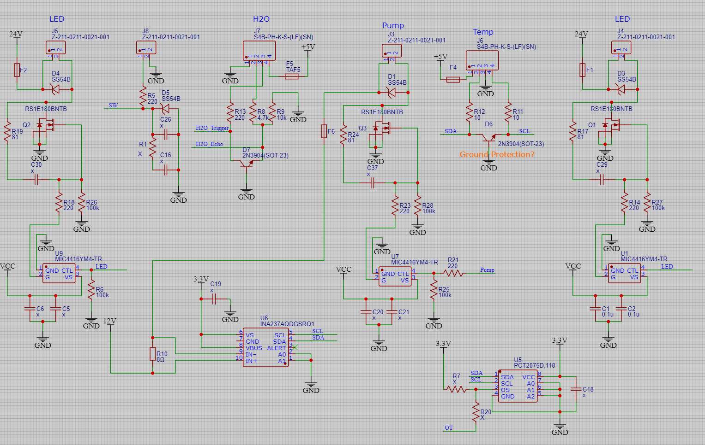
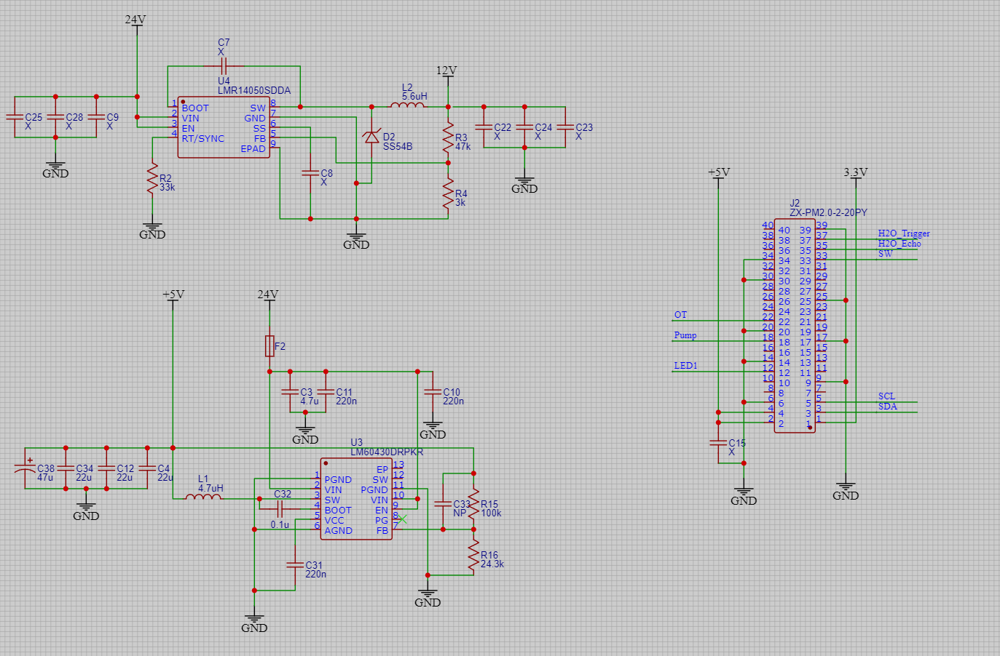

# Garden of Eden

Truly own that which is yours!

If you are interested in collaborating please review the [CONTRIBUTORS](CONTRIBUTORS.md) for commit styling guides.

## Project Status & Milestones

Work in progress. We should be picking up some steam here to give the DYI community the features you deserve.

[Milestones](https://github.com/iot-root/garden-of-eden/milestones)

## Table of Contents

- [Garden of Eden](#garden-of-eden)
  - [Project Status \& Milestones](#project-status--milestones)
  - [Table of Contents](#table-of-contents)
  - [Getting Started](#getting-started)
    - [Prerequisites](#prerequisites)
  - [Usage](#usage)
    - [Testing](#testing)
    - [Controlling Individual Sensors](#controlling-individual-sensors)
    - [REST API](#rest-api)
      - [Endpoints](#endpoints)
      - [Postman](#postman)
    - [Cron Job](#cron-job)
    - [MQTT](#mqtt)
  - [Hardware Overview](#hardware-overview)
    - [Air Temp \& Humidity Sensor](#air-temp--humidity-sensor)
    - [Pump Power Monitor](#pump-power-monitor)
    - [PCB Temp Sensor](#pcb-temp-sensor)
    - [Lights](#lights)
      - [Method](#method)
      - [Pins](#pins)
    - [Pump](#pump)
      - [Method](#method-1)
      - [Pins](#pins-1)
    - [Camera](#camera)
      - [Method](#method-2)
      - [Devices](#devices)
    - [Water Level Sensor](#water-level-sensor)
      - [Pins](#pins-2)
      - [Method](#method-3)
      - [References](#references)
    - [Momentary Button](#momentary-button)
    - [Electrical Diagrams](#electrical-diagrams)
      - [Sensors](#sensors)
      - [Power and Header](#power-and-header)
    - [Recommendations](#recommendations)
      - [Upgrading the Pi Zero 2](#upgrading-the-pi-zero-2)
  - [Design Decisions](#design-decisions)
    - [Python Version 3.6 \>=](#python-version-36-)
    - [Delays in Reading Temp/Humidity data](#delays-in-reading-temphumidity-data)
    - [GPIO](#gpio)
  - [Folder Structure](#folder-structure)

## Getting Started

### Prerequisites

Start with a clean install of Linux. Use the [RaspberryPi Imager](https://www.raspberrypi.com/software/). Ensure ssh and wifi is setup. Once the image is written, pop the SDcard into the pi and ssh into it.

```bash
# clone repo
git clone git@github.com:iot-root/garden-of-eden.git
cd garden-of-eden 
```

Update the `.env` with mqtt broker info

```
cp .env-dist .env
nano .env
```

Install dependencies, and run services pigpiod, mqtt.service

```
./bin/setup.sh`
```

Ensure the pigpiod daemon is running

```
sudo systemctl status pigpiod
sudo systemctl status mqtt.service
```

## Usage

### MQTT with HomeAssistant 
For homeassistant:

You need a mqtt broker either on the gardyn pi or homeassistant. 

To install on the pi run 

```
sudo apt-get install mosquitto mosquitto-clients
```

Add mqtt-broker username and password:

`sudo mosquitto_passwd -c /etc/mosquitto/passwd <USERNAME>`

> Note: make sure to update the .env file which is used by `config.py` for `mqtt.py`

Run `sudo nano /etc/mosquitto/mosquitto.conf` and change the following lines to match:

```
allow_anonymous false
password_file /etc/mosquitto/passwd
listener 1883
```

Restart the service 

```
sudo systemctl restart mosquitto
```

you just need to edit the `.env` 

If you havent already, run `./bin/setup.sh`, this will install all OS dependencies, install the python libs, and run services pigpiod, mqtt.service

Ensure the pigpiod, mqtt, and broker daemon is running

```
sudo systemctl status pigpiod
sudo systemctl status mqtt.service
sudo systemctl status mosquitto
```
Go to your homeassistant instance:
If your broker is on the gardyn pi, make sure to install the service mqtt, go to settings->devices&services->mqtt and add your gardyn pi host, port, username and password. 
The device should then appear in your homeassistant discovery settings.

### Testing

Activate python venv `source venv/bin/activate`

Start the Flask REST API `python run.py`

Test options:
```bash
# REST endpoints
./bin/api-test.sh

# unit test
python -m unittest -v

# individual tests
python tests/test_distance.py
```

### Controlling Individual Sensors

Activate python venv `source venv/bin/activate`

Examples:
```bash
python app/sensors/distance/distance.py
python app/sensors/humidity/humidity.py
python app/sensors/light/light.py [--on] [--off] [--brightness INT%]
python app/sensors/pcb_temp/pcb_temp.py
python app/sensors/pump/pump.py [--on] [--off] [--speed INT%] [--factory-host STR%] [--factory-port INT%]
python app/sensors/temperature/temperature.py
```

### REST API
Activate python venv `source venv/bin/activate`

Then Run `python run.py`, this will print the ip to send requests.

> **Note:** if run.py errors with: AttributeError: module 'dotenv' has no attribute 'find_dotenv'
```
pip uninstall python-dotenv
python run.py
```

#### Endpoints

```
[GET] http://<pi-ip>:5000/distance

[GET] http://<pi-ip>:5000/humidity

[POST] http://<pi-ip>:5000/light/on
[POST] http://<pi-ip>:5000/light/off
[POST] http://<pi-ip>:5000/light/brightness body:{"value": 50 }
[GET] http://<pi-ip>:5000/light/brightness

[GET] http://<pi-ip>:5000/temperature

[GET] http://<pi-ip>:5000/pcb-temp

[POST] http://<pi-ip>:5000/pump/on
[POST] http://<pi-ip>:5000/pump/off
[POST] http://<pi-ip>:5000/pump/speed body:{"value": 50 }
[GET] http://<pi-ip>:5000/pump/speed
[GET] http://<pi-ip>:5000/pump/stats
```

#### Postman

Export this [Postman collection](https://www.postman.com/orange-shadow-8689/workspace/garden-of-eden/collection/8244324-e9d8f79e-d3f2-423e-b0d1-a4ca5b1b08ca?action=share&creator=8244324&active-environment=8244324-861384b4-b4e3-48a3-8da1-181705bd2d8c), add to your private workspace, add the `pi-ip` env variable and you should be good to go.

### Cron Job

Run `crontab -e`, select your preferred editor and then add the following job. Edit as needed.

> Note: update your paths for the following...

```text
# †urn on lights at 6am, 9am, 5pm, and turn off at 8pm
0 6 * * * /home/gardyn/projects/garden-of-eden/venv/bin/python /home/gardyn/projects/garden-of-eden/app/sensors/light/light.py --on --brightness 50
0 9 * * * /home/gardyn/projects/garden-of-eden/venv/bin/python /home/gardyn/projects/garden-of-eden/app/sensors/light/light.py --on --brightness 70
0 17 * * * /home/gardyn/projects/garden-of-eden/venv/bin/python /home/gardyn/projects/garden-of-eden/app/sensors/light/light.py --on --brightness 50
0 20 * * * /home/gardyn/projects/garden-of-eden/venv/bin/python /home/gardyn/projects/garden-of-eden/app/sensors/light/light.py --off

# Pump run at 8am for 5 minutes
0 8 * * * /home/gardyn/projects/garden-of-eden/venv/bin/python /home/gardyn/projects/garden-of-eden/app/sensors/pump/pump.py --on --speed 100
5 8 * * * /home/gardyn/projects/garden-of-eden/venv/bin/python /home/gardyn/projects/garden-of-eden/app/sensors/pump/pump.py --off

# Pump run at 4pm 5 minutes
0 16 * * * /home/gardyn/projects/garden-of-eden/venv/bin/python /home/gardyn/projects/garden-of-eden/app/sensors/pump/pump.py --on --speed 100
5 16 * * * /home/gardyn/projects/garden-of-eden/venv/bin/python /home/gardyn/projects/garden-of-eden/app/sensors/pump/pump.py --off

# Pump run at 9pm for 5 minutes
0 21 * * * /home/gardyn/projects/garden-of-eden/venv/bin/python /home/gardyn/projects/garden-of-eden/app/sensors/pump/pump.py --on --speed 100
5 21 * * * /home/gardyn/projects/garden-of-eden/venv/bin/python /home/gardyn/projects/garden-of-eden/app/sensors/pump/pump.py --off

# Collect sensor data every 30 mins
*/30 * * * * /home/gardyn/projects/garden-of-eden/bin/get-sensor-data.sh
```

## Hardware Overview

Depending on the system you have, here is a breakdown of the hardware.

Notes:

- GPIO num is different than pin number. See (<https://pinout.xyz/>)

### Air Temp & Humidity Sensor

- temp/humidity sensor AM2320 at address of `0x38`

### Pump Power Monitor

- motor power usage sensor INA219 at address of `0x40`

### PCB Temp Sensor

- pcb temp sensor PCT2075 at address `pf 0x48`

When you run `sudo i2cdetect -y 1`, you should see something like:

```
     0  1  2  3  4  5  6  7  8  9  a  b  c  d  e  f
00:          -- -- -- -- -- -- -- -- -- -- -- -- --
10: -- -- -- -- -- -- -- -- -- -- -- -- -- -- -- --
20: -- -- -- -- -- -- -- -- -- -- -- -- -- -- -- --
30: -- -- -- -- -- -- -- -- 38 -- -- -- -- -- -- --
40: 40 -- -- -- -- -- -- -- 48 -- -- -- -- -- -- --
50: -- -- -- -- -- -- -- -- -- -- -- -- -- -- -- --
60: -- -- -- -- -- -- -- -- -- -- -- -- -- -- -- --
70: -- -- -- -- -- -- -- --
```

### Lights

LED full spectrum lights.

#### Method

- Lights are driven by PWM duty and a frequency of 8 kHz.

#### Pins

- [GPIO-18 | PIN-12](https://pinout.xyz/pinout/pin12_gpio18/)

### Pump

#### Method

- The pump is driven by PWM with max duty of 30% and frequency of 50 Hz
- There is a current sensor to measure pump draw and a overtemp sensor to determine if board monitor PCB temp.

#### Pins

- [GPIO-24 | PIN-18](https://pinout.xyz/pinout/pin18_gpio24/)

Notes:

- Pump duty cycle is limited, likely full on is too much current draw for the system.

### Camera

Two USB cameras.

#### Method

- image capture with fswebcam

#### Devices

- /dev/video0
- /dev/video1

### Water Level Sensor

Uses the ultrasonic distance sensor DYP-A01-V2.0.

#### Pins

- [GPIO-19 | PIN-35](https://pinout.xyz/pinout/pin35_gpio19/): water level in (trigger)
- [GPIO-26 | PIN-37](https://pinout.xyz/pinout/pin37_gpio26/): water level out (echo)

#### Method

- Uses time between the echo and response to deterine the distances.

#### References

- <https://www.google.com/search?q=DYP-A01-V2.0>
- <https://www.dypcn.com/uploads/A02-Datasheet.pdf>

### Momentary Button

`<section incomplete>`

### Electrical Diagrams

Incase you need to troubleshoot any problems with your system.

#### Sensors



#### Power and Header



### Recommendations

#### Upgrading the Pi Zero 2

For better performance, the Pi Zero can be replaced with a Pi Zero 2. This will enable the use of VS Code Remote Server to edit files and debug the python code remotely. The VS Code remote server uses OpenSSH and the minimum architecture is ARMv7.

> Buy one **without** a header, you will need to solder one on in the opposite direction.

## Design Decisions

### Python Version 3.6 >=

Minimum python version of 3.6 to support `printf()`

### Delays in Reading Temp/Humidity data

Reading sensor values  with inherently long delays and responding to the REST API. To minimize the delay in subsequent readings the value is cached and given if another read occurs within two seconds.

### GPIO

Using `gpiozero` to leverage `pigpio` daemon which is hardware driven and more efficient.This ensures better accuracy of the distance sensor and is less cpu intensive when using PWMs.

## Folder Structure

```text
<gardyn-of-eden>
├── run.py
├── app
│   ├── __init__.py
│   └── sensors
│       ├── config.py
│       ├── distance
│       │   ├── distance.py
│       │   ├── __init__.py
│       │   └── routes.py
│       ├── __init__.py
│       ├── light
│       │   ├── __init__.py
│       │   ├── light.py
│       │   └── routes.py
│       └── pump
│           ├── __init__.py
│           ├── pump.py
│           └── routes.py
└── tests
    ├── __init__.py
    ├── test_distance.py
    ├── test_light.py
    └── test_pump.py
```
