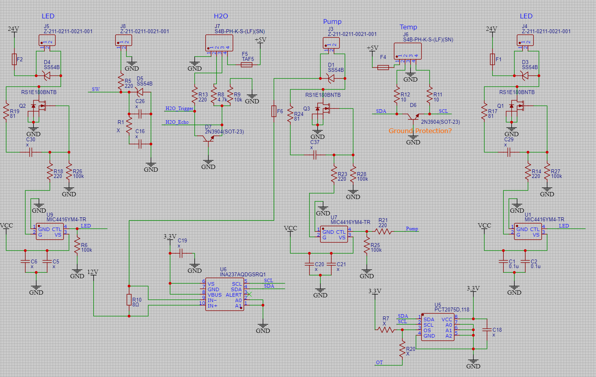
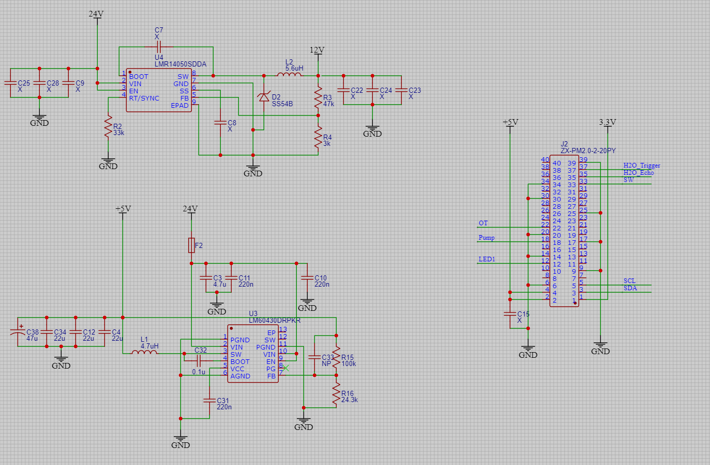

# Garden of Eden

Truly own that which is yours!

If you are interested in collaborating please review the [CONTRIBUTORS](CONTRIBUTORS.md) for commit styling guides.

## Video Tutorial for Gardyn of Eden and Homeassistant

Thanks to "Yong" for very well edited video tutorial.

[Video Tutorial](https://www.youtube.com/watch?v=gH5yu8JwS8Y)

## Project Status & Milestones

Work in progress. We should be picking up some steam here to give the DYI community the features you deserve.

[Milestones](https://github.com/iot-root/garden-of-eden/milestones)


## What's new

A set of changes closing out the open milestones:

- **Built-in web UI** — a self-contained control page served by the firmware at
  `http://gardyn.local:5000/` (controls, live sensors + pump power, cameras, grow
  cycle, full schedule editor, run-pump-for-N-seconds). Auto-starts as a service;
  no separate app required. See [`docs/access.md`](docs/access.md).
- **Headless-friendly** — `setup.sh` keeps **SSH on** and sets up mDNS so the unit
  is reachable at `gardyn.local` right after flashing.

> Installing on a Pi? Follow [`docs/INSTALL.md`](docs/INSTALL.md), a step-by-step,
> brick-safe install (dry-run, backups, uninstall).
- **Self-sufficient REST API** — camera, scheduling, grow-cycle, and system/model
  endpoints (see below), with optional API-key auth.
- **Home Assistant** — the physical button is now an HA `event` entity
  (single/double/long); example dashboard in
  [`docs/homeassistant/`](docs/homeassistant/lovelace-example.yaml).
- **Grow-cycle reminders** — thinning, root-check, harvest, and nutrient
  notifications via MQTT/REST.
- **Resilience** — shared pigpio connection, sensor auto-reprobe, power-loss
  state recovery, graceful shutdown.
- **Ops** — Docker/compose, CI (lint + tests), automated changelog, hardened
  setup with OS checks and camera udev rules.
- **Config** — all pins/addresses/thresholds live in `config.py` / `.env`.

See [`docs/design.md`](docs/design.md) for architecture, and
[`docs/maintenance.md`](docs/maintenance.md) for upkeep.

### REST API endpoints

| Method | Path | Purpose |
|--------|------|---------|
| POST | `/light/on` `/light/off` | toggle grow light |
| POST/GET | `/light/brightness` | set/get brightness (0–100) |
| POST | `/pump/on` `/pump/off` | toggle pump |
| POST/GET | `/pump/speed` | set/get pump speed |
| GET | `/pump/stats` | INA219 power data |
| GET | `/distance` `/distance/measure` | water-level distance (cm) |
| GET | `/temperature` `/humidity` `/pcb-temp` | environment sensors |
| GET | `/camera/upper` `/camera/lower` | capture a still (JPEG) |
| GET/POST | `/schedule` | lights/pump cron schedule |
| GET | `/grow` · POST `/grow/start` `/grow/stage` `/grow/acknowledge` | grow-cycle |
| GET | `/system` | identity, version, detected model/profile |

### Run with Docker

```bash
cp .env-dist .env          # edit MQTT + identity
sudo pigpiod -p 8888       # pigpiod on the Pi host
docker compose up -d       # api (:5000) + mqtt + optional broker
```

See [`docs/integrations/`](docs/integrations/README.md) for Telegraf, ThingsBoard,
and Alexa.

### Test it without a Pi

A simulator runs the whole stack with fake hardware so you can try the web UI,
REST API, and Home Assistant discovery on your laptop:

```bash
python -m venv .venv-dev && .venv-dev/bin/pip install -r requirements-dev.txt
.venv-dev/bin/python -m simulator.serve     # http://localhost:5000/
.venv-dev/bin/python -m simulator.mqtt_sim  # MQTT for Home Assistant (needs a broker)
```

See [`docs/simulator.md`](docs/simulator.md).

## Table of Contents

- [Garden of Eden](#garden-of-eden)
  - [Project Status \& Milestones](#project-status--milestones)
  - [Table of Contents](#table-of-contents)
  - [Getting Started](#getting-started)
    - [Prerequisites](#prerequisites)
  - [Usage](#usage)
    - [MQTT with HomeAssistant](#mqtt-with-homeassistant)
    - [Testing](#testing)
    - [Developing](#developing)
    - [Controlling Individual Sensors](#controlling-individual-sensors)
    - [REST API](#rest-api)
      - [Endpoints](#endpoints)
      - [Postman](#postman)
    - [Cron Job](#cron-job)
  - [Hardware Overview](#hardware-overview)
    - [Air Temp \& Humidity Sensor](#air-temp--humidity-sensor)
    - [Pump Power Monitor](#pump-power-monitor)
    - [PCB Temp Sensor](#pcb-temp-sensor)
    - [Lights](#lights)
      - [Method](#method)
      - [Pins](#pins)
    - [Pump](#pump)
      - [Method](#method-1)
      - [Pins](#pins-1)
    - [Camera](#camera)
      - [Method](#method-2)
      - [Devices](#devices)
    - [Water Level Sensor](#water-level-sensor)
      - [Pins](#pins-2)
      - [Method](#method-3)
      - [References](#references)
    - [Momentary Button](#momentary-button)
    - [Electrical Diagrams](#electrical-diagrams)
      - [Sensors](#sensors)
      - [Power and Header](#power-and-header)
    - [Recommendations](#recommendations)
      - [Upgrading the Pi Zero 2](#upgrading-the-pi-zero-2)
  - [Design Decisions](#design-decisions)
    - [Python Version 3.9 \>=](#python-version-39-)
    - [Delays in Reading Temp/Humidity data](#delays-in-reading-temphumidity-data)
    - [GPIO](#gpio)
  - [Folder Structure](#folder-structure)

## Getting Started

### Prerequisites

Start with a clean install of Linux. Use the [RaspberryPi Imager](https://www.raspberrypi.com/software/). Ensure ssh and wifi is setup. Once the image is written, pop the SDcard into the pi and ssh into it.

```bash
# clone repo
git clone git@github.com:iot-root/garden-of-eden.git
cd garden-of-eden 
```

Update the `.env` with mqtt broker info

```
cp .env-dist .env
nano .env
```

Install dependencies, and run services pigpiod, mqtt.service

```
./bin/setup.sh`
```

Ensure the pigpiod daemon is running

```
sudo systemctl status pigpiod
sudo systemctl status mqtt.service
```

## Usage

## Quick Toggle Guide

> Ensure your press is quick and within the time frame for the action to register correctly. The press time window can be modified directly in the `mqtt.py` file.

- **One Press** (within 1 second): 
  - **Action**: Toggles the **Lights** on or off. 
  - **Description**: A single, swift press will illuminate or darken your space with ease.

- **Two Presses** (within 1 second): 
  - **Action**: Toggles the **Pump** on or off.
  - **Description**: Need to water the garden or fill up the pool? Double tap for action!


### MQTT with HomeAssistant

For homeassistant:

You need a mqtt broker either on the gardyn pi or homeassistant.

To install on the pi run

```
sudo apt-get install mosquitto mosquitto-clients
```

Add mqtt-broker username and password:

`sudo mosquitto_passwd -c /etc/mosquitto/passwd <USERNAME>`

> Note: make sure to update the .env file which is used by `config.py` for `mqtt.py`

Run `sudo nano /etc/mosquitto/mosquitto.conf` and change the following lines to match:

```
allow_anonymous false
password_file /etc/mosquitto/passwd
listener 1883
```


Here are some additional options that you could set in `/etc/mosquitto/mosquitto.conf`:

```
pid_file /run/mosquitto/mosquitto.pid

persistence true
persistence_location /var/lib/mosquitto/

log_dest file /var/log/mosquitto/mosquitto.log

listener 1883 0.0.0.0

allow_anonymous false
password_file /etc/mosquitto/passwd

include_dir /etc/mosquitto/conf.d
```


Restart the service

```
sudo systemctl restart mosquitto
```

you just need to edit the `.env` with the mosquitto username and password created above in /etc/mosquitto/passwd.


Check the configuration works:

`sudo journalctl -xeu mosquitto.service`


If you havent already, run `./bin/setup.sh`, this will install all OS dependencies, install the python libs, and run services pigpiod, mqtt.service

Ensure the pigpiod, mqtt, and broker daemon is running

```
sudo systemctl status pigpiod
sudo systemctl status mqtt.service
sudo systemctl status mosquitto
```

Go to your homeassistant instance:
If your broker is on the gardyn pi, make sure to install the service mqtt, go to settings->devices&services->mqtt and add your gardyn pi host, port, username and password.
The device should then appear in your homeassistant discovery settings.

To test locally on gardyn pi:

Light:

```
mosquitto_pub -t "gardyn/light/command" -m "ON" -u gardyn -P "somepassword"
mosquitto_pub -t "gardyn/light/command" -m "OFF" -u gardyn -P "somepassword"
```

Pump:

```
mosquitto_pub -t "gardyn/pump/command" -m "ON" -u gardyn -P "somepassword"
mosquitto_pub -t "gardyn/pump/command" -m "OFF" -u gardyn -P "somepassword"
```

Sensors:

Open two terminals on the gardyn pi, in one run:

`mosquitto_sub -t "gardyn/water/level" -u gardyn -P "somepassword"`

In the second gardyn pi terminal, run:

`mosquitto_pub -t "gardyn/water/level/get" -m ""-r  -u gardyn -P "somepassword"`

```

### Testing

Activate python venv `source venv/bin/activate`

Start the Flask REST API `python run.py`

Test options:

```bash
# REST endpoints
./bin/api-test.sh

# unit tests (the -t . -s tests form is required, see Developing below)
python -m unittest discover -t . -s tests -p 'test_*.py'

# one test module
python -m unittest tests.test_distance
```

### Developing

Short version of how to work on this without a Pi in front of you, and how to add something so it fits with the rest.

#### Set up once

```bash
python -m venv .venv-dev
.venv-dev/bin/pip install -r requirements-dev.txt
```

That's the pure-Python dev set. The Pi deps in `requirements.txt` (gpiozero, pigpio, the Adafruit libs) are not needed and won't install cleanly on a laptop anyway.

#### Run the checks

```bash
.venv-dev/bin/python -m unittest discover -t . -s tests -p 'test_*.py'
.venv-dev/bin/ruff check .
.venv-dev/bin/black --check .
```

CI runs exactly these three on every PR. The `-t . -s tests` part matters: `tests/__init__.py` installs fake hardware modules before anything under `app/` is imported, and plain `python -m unittest` skips that bootstrap and fails on the first `import gpiozero`.

#### How the fake hardware works

`tests/_hwstub.py` drops stand-ins for `board`, `busio`, `gpiozero`, `pigpio`, `smbus` and the `adafruit_*` modules into `sys.modules`, but only if the real ones aren't installed. On a Pi the real libraries win, so the same tests run against hardware. The stubs are deliberately dumb; a test that needs a specific reading patches the driver method it cares about.

#### Where things go

- **Pins, I2C addresses, thresholds, paths:** `config.py`, read from `.env`. Add the key there with a default, document it in `.env-dist`, and if it's a physical pin, add it to the sensor's "Pins" list under [Hardware Overview](#hardware-overview). Never hardcode a pin in a driver.
- **Drivers:** `app/sensors/<name>/<name>.py`. A class that takes `pin_factory=None` and defaults everything from `config`. Give it a `__main__` block with argparse so it can be run by hand on the Pi.
- **Routes:** `app/sensors/<name>/routes.py`. A Flask `Blueprint`, the driver built once at import inside `try/except` (so a missing sensor doesn't take the whole API down), and every route wrapped with `check_sensor_guard`. The guard gives you 400 if the driver never initialised, 503 if the hardware throws mid-request, and 400 on a `ValueError`, so raise `ValueError` for bad input and let it handle the response. For 0-100 inputs use `parse_level` from `app/lib/lib.py` instead of validating by hand.
- **Logging:** `logging.getLogger(__name__)` in modules, never `print`. Any new entry point (a script with a `__main__`, a service) calls `configure_logging()` from `app/lib/logging_config.py` once at startup; level comes from `LOG_LEVEL` in `.env`.
- **Tests:** `tests/test_<name>.py`. Import the driver or `create_app`, patch what you need, assert on the result.

#### Adding a feature, start to finish

1. Open an issue that says what's wrong or what you want. One issue per change.
2. Branch from `dev` named after it, e.g. `123-fix-pump-timeout`.
3. Write the test first if you can. It'll fail. That's the point.
4. Add the config key, then the driver change, then the route.
5. Run the three checks above until green.
6. Commit as `feat(scope): what it does` or `fix(scope): ...` with `Refs: #123` in the footer.
7. Open the PR against `dev`. Title under 50 characters, starting with `feat`, `fix`, `doc`, `test` or `ci` (the title check rejects anything else). Fill in the template for real.
8. Merge with a merge commit, not squash, so the history stays readable.

If it touches hardware behavior, say in the PR whether you ran it on a real unit and which model.


### Controlling Individual Sensors

Activate python venv `source venv/bin/activate`

Examples:

```bash
python app/sensors/distance/distance.py
python app/sensors/humidity/humidity.py
python app/sensors/light/light.py [--on] [--off] [--brightness INT%]
python app/sensors/pcb_temp/pcb_temp.py
python app/sensors/pump/pump.py [--on] [--off] [--speed INT%] [--factory-host STR%] [--factory-port INT%]
python app/sensors/temperature/temperature.py
```

### REST API

Activate python venv `source venv/bin/activate`

Then Run `python run.py`, this will print the ip to send requests.

> **Note:** if run.py errors with: AttributeError: module 'dotenv' has no attribute 'find_dotenv'

```
pip uninstall python-dotenv
python run.py
```

#### Endpoints

```
[GET] http://<pi-ip>:5000/distance

[GET] http://<pi-ip>:5000/humidity

[POST] http://<pi-ip>:5000/light/on
[POST] http://<pi-ip>:5000/light/off
[POST] http://<pi-ip>:5000/light/brightness body:{"value": 50 }
[GET] http://<pi-ip>:5000/light/brightness

[GET] http://<pi-ip>:5000/temperature

[GET] http://<pi-ip>:5000/pcb-temp

[POST] http://<pi-ip>:5000/pump/on
[POST] http://<pi-ip>:5000/pump/off
[POST] http://<pi-ip>:5000/pump/speed body:{"value": 50 }
[GET] http://<pi-ip>:5000/pump/speed
[GET] http://<pi-ip>:5000/pump/stats
```

#### Postman

Export this [Postman collection](https://www.postman.com/orange-shadow-8689/workspace/garden-of-eden/collection/8244324-e9d8f79e-d3f2-423e-b0d1-a4ca5b1b08ca?action=share&creator=8244324&active-environment=8244324-861384b4-b4e3-48a3-8da1-181705bd2d8c), add to your private workspace, add the `pi-ip` env variable and you should be good to go.

### Cron Job

Run `crontab -e`, select your preferred editor and then add the following job. Edit as needed.

> Note: update your paths for the following...

```text
# †urn on lights at 6am, 9am, 5pm, and turn off at 8pm
0 6 * * * /home/gardyn/projects/garden-of-eden/venv/bin/python /home/gardyn/projects/garden-of-eden/app/sensors/light/light.py --on --brightness 50
0 9 * * * /home/gardyn/projects/garden-of-eden/venv/bin/python /home/gardyn/projects/garden-of-eden/app/sensors/light/light.py --on --brightness 70
0 17 * * * /home/gardyn/projects/garden-of-eden/venv/bin/python /home/gardyn/projects/garden-of-eden/app/sensors/light/light.py --on --brightness 50
0 20 * * * /home/gardyn/projects/garden-of-eden/venv/bin/python /home/gardyn/projects/garden-of-eden/app/sensors/light/light.py --off

# Pump run at 8am for 5 minutes
0 8 * * * /home/gardyn/projects/garden-of-eden/venv/bin/python /home/gardyn/projects/garden-of-eden/app/sensors/pump/pump.py --on --speed 100
5 8 * * * /home/gardyn/projects/garden-of-eden/venv/bin/python /home/gardyn/projects/garden-of-eden/app/sensors/pump/pump.py --off

# Pump run at 4pm 5 minutes
0 16 * * * /home/gardyn/projects/garden-of-eden/venv/bin/python /home/gardyn/projects/garden-of-eden/app/sensors/pump/pump.py --on --speed 100
5 16 * * * /home/gardyn/projects/garden-of-eden/venv/bin/python /home/gardyn/projects/garden-of-eden/app/sensors/pump/pump.py --off

# Pump run at 9pm for 5 minutes
0 21 * * * /home/gardyn/projects/garden-of-eden/venv/bin/python /home/gardyn/projects/garden-of-eden/app/sensors/pump/pump.py --on --speed 100
5 21 * * * /home/gardyn/projects/garden-of-eden/venv/bin/python /home/gardyn/projects/garden-of-eden/app/sensors/pump/pump.py --off

# Collect sensor data every 30 mins
*/30 * * * * /home/gardyn/projects/garden-of-eden/bin/get-sensor-data.sh
```

## Hardware Overview

Depending on the system you have, here is a breakdown of the hardware.

Notes:

- GPIO num is different than pin number. See (<https://pinout.xyz/>)

### Air Temp & Humidity Sensor

- temp/humidity sensor AM2320 at address of `0x38`

### Pump Power Monitor

- motor power usage sensor INA219 at address of `0x40`

### PCB Temp Sensor

- pcb temp sensor PCT2075 at address `pf 0x48`

When you run `sudo i2cdetect -y 1`, you should see something like:

```
     0  1  2  3  4  5  6  7  8  9  a  b  c  d  e  f
00:          -- -- -- -- -- -- -- -- -- -- -- -- --
10: -- -- -- -- -- -- -- -- -- -- -- -- -- -- -- --
20: -- -- -- -- -- -- -- -- -- -- -- -- -- -- -- --
30: -- -- -- -- -- -- -- -- 38 -- -- -- -- -- -- --
40: 40 -- -- -- -- -- -- -- 48 -- -- -- -- -- -- --
50: -- -- -- -- -- -- -- -- -- -- -- -- -- -- -- --
60: -- -- -- -- -- -- -- -- -- -- -- -- -- -- -- --
70: -- -- -- -- -- -- -- --
```

### Lights

LED full spectrum lights.

#### Method

- Lights are driven by PWM duty and a frequency of 8 kHz.

#### Pins

- [GPIO-18 | PIN-12](https://pinout.xyz/pinout/pin12_gpio18/)

### Pump

#### Method

- The pump is driven by PWM with max duty of 30% and frequency of 50 Hz
- There is a current sensor to measure pump draw and a overtemp sensor to determine if board monitor PCB temp.

#### Pins

- [GPIO-24 | PIN-18](https://pinout.xyz/pinout/pin18_gpio24/)

Notes:

- Pump duty cycle is limited, likely full on is too much current draw for the system.

### Camera

Two USB cameras.

#### Method

- image capture with fswebcam

#### Devices

- /dev/video0
- /dev/video1

### Water Level Sensor

Uses the ultrasonic distance sensor DYP-A01-V2.0.

#### Pins

- [GPIO-19 | PIN-35](https://pinout.xyz/pinout/pin35_gpio19/): water level in (trigger)
- [GPIO-26 | PIN-37](https://pinout.xyz/pinout/pin37_gpio26/): water level out (echo)

#### Method

- Uses time between the echo and response to deterine the distances.

#### References

- <https://www.google.com/search?q=DYP-A01-V2.0>
- <https://www.dypcn.com/uploads/A02-Datasheet.pdf>

### Momentary Button

`<section incomplete>`

### Electrical Diagrams

Incase you need to troubleshoot any problems with your system.

#### Sensors



#### Power and Header



### Recommendations

#### Upgrading the Pi Zero 2

For better performance, the Pi Zero can be replaced with a Pi Zero 2. This will enable the use of VS Code Remote Server to edit files and debug the python code remotely. The VS Code remote server uses OpenSSH and the minimum architecture is ARMv7.

> Buy one **without** a header, you will need to solder one on in the opposite direction.

## Design Decisions

### Python Version 3.9 >=

Minimum Python version is 3.9: it is what `pyproject.toml` and CI target and what the supported Raspberry Pi OS releases ship. (3.6 was the original floor for f-strings.)

### Delays in Reading Temp/Humidity data

Reading sensor values  with inherently long delays and responding to the REST API. To minimize the delay in subsequent readings the value is cached and given if another read occurs within two seconds.

### GPIO

Using `gpiozero` to leverage `pigpio` daemon which is hardware driven and more efficient.This ensures better accuracy of the distance sensor and is less cpu intensive when using PWMs.

## Folder Structure

```text
<gardyn-of-eden>
├── run.py
├── app
│   ├── __init__.py
│   └── sensors
│       ├── config.py
│       ├── distance
│       │   ├── distance.py
│       │   ├── __init__.py
│       │   └── routes.py
│       ├── __init__.py
│       ├── light
│       │   ├── __init__.py
│       │   ├── light.py
│       │   └── routes.py
│       └── pump
│           ├── __init__.py
│           ├── pump.py
│           └── routes.py
└── tests
    ├── __init__.py
    ├── test_distance.py
    ├── test_light.py
    └── test_pump.py
```
